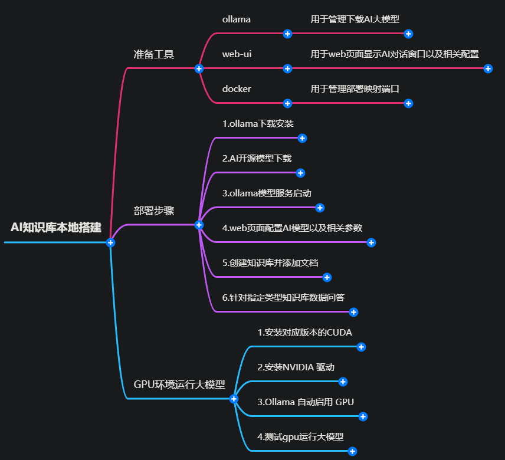

# ai知识库本地部署



## 准备
- 本地 LLM 服务 (Ollama)
- 拉取模型
- 启动服务：Ollama 会自动在后台运行，提供 http://localhost:11434 的 API


```shell
ollama serve         #启动ollama
ollama create        #从模型文件创建模型
ollama show          #显示模型信息
ollama run           #运行模型
ollama pull          #从注册表中拉取模型
ollama push          #将模型推送到注册表
ollama list          #列出模型
ollama cp            #复制模型
ollama rm            #删除模型
ollama help          #获取有关任何命令的帮助信息  

```
```shell
# 更改ollama模型存放位置，避免c盘爆满
set OLLAMA_MODELS=D:\Ollama\Models
$env:OLLAMA_MODELS = "D:\Ollama\Models"
```
```shell
# 开启ollma服务,终端输入
ollama serve
```
## Open-webui安装部署

```shell
# 推荐使用uv安装
uv init mywebui -p 3.12
uv add open-webui --default-index https://pypi.tuna.tsinghua.edu.cn/simple

# 开启服务
uv run open-webui serve
```
>浏览器打开 [localhost:8080](https://localhost:8080)